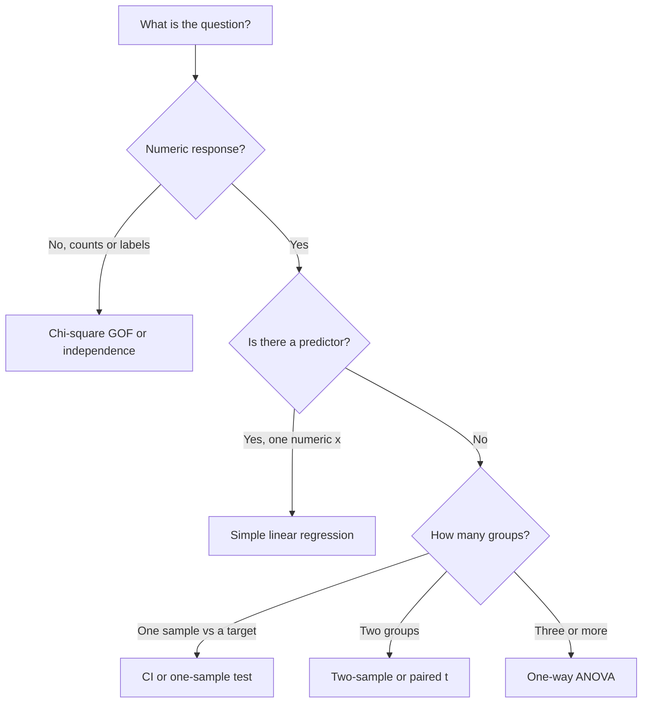

---
tags:
    - Method Choice
    - Integrated Analysis
    - Exam Preparation
---

<h1 align="center">Integrated Statistical Analysis and Exam Preparation</h1>

The last session is synthesis: choose a method, run a complete analysis from raw data to a recommendation, and practise the oral format. Always start with plots from Session 01. Always end with a sentence that a colleague in production or operations could use.

A short method map is enough for most STA1 questions:

The group project is the same kind of analysis at slightly larger scale. The oral exam starts from one assignment and then discusses the project.

#### Key Concepts

- Method choice from the question, not from a favourite procedure
- A complete workflow: import, plots, justified method, conclusion
- Communicating uncertainty and assumptions
- Relating an assignment to the project
- The 20-minute oral format

!!! tip "Learning Objectives"

    - Choose among descriptive methods, intervals, one- and two-sample tests, ANOVA, regression, and chi-square tests.
    - Carry a data set from import and plots through a justified method to a written conclusion.
    - Communicate uncertainty and assumptions to a non-specialist.
    - Explain one assignment and the project in about 20 minutes.

### Session Preparation:

Brooks: [Chapter 12](https://docs.google.com/viewer?url=https://raw.githubusercontent.com/RBrooksDK/STA_book_v1/main/main.pdf)

Revisit your six assignments and the [project](../pages/assignments.md#group-project). Bring questions about the oral exam.

### Resources

[Session material](https://github.com/RBrooksDK/STA1_26/tree/main/12_Integrated_Analysis_and_Exam_Preparation/session_material)

[Tutorial 12: From raw data to a recommendation](Tutorial_12_notebook/)

[Exam](../pages/exam.md)

[Assignments and project](../pages/assignments.md)

### Exercises
