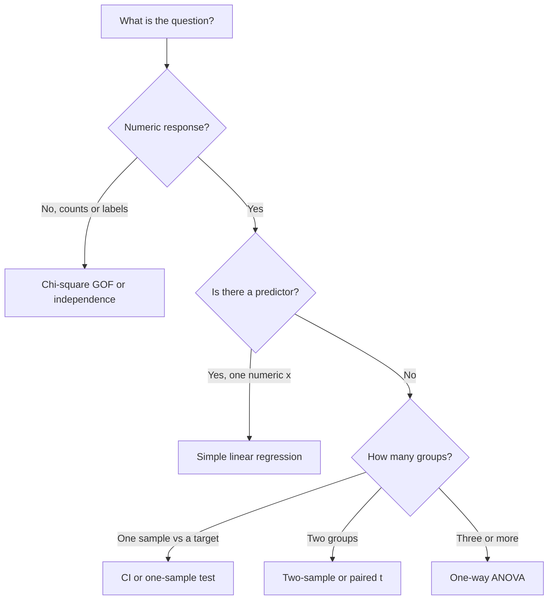

# 12 — Integrated Statistical Analysis and Exam Preparation

## Session preparation

Read Chapter 12, *Integrated Statistical Analysis and Exam Preparation*, in the course textbook
[*Statistics and Data Analysis for Engineers*](https://raw.githubusercontent.com/RBrooksDK/STA_book_v1/main/main.pdf).
Revisit the [method map](#method-choice) below, your six assignments, and the [project framework](../pages/project.md). Bring questions about the oral exam.

**Syllabus and input**

- Brooks, *Statistics and Data Analysis for Engineers*, Chapter 12
- Course tutorials 01–11
- [Exam page](../pages/exam.md)
- [Session material](https://github.com/RBrooksDK/STA1_26/tree/main/12_Integrated_Analysis_and_Exam_Preparation/session_material)

---

## Session focus

The last session is synthesis: choose a method, run a complete analysis from raw data to a recommendation, and practise the oral format.

By the end of the session, you should be able to:

- choose among descriptive methods, intervals, one- and two-sample tests, ANOVA, regression, and chi-square tests;
- carry a data set from import and plots through a justified method to a written conclusion;
- communicate uncertainty and assumptions to a non-specialist;
- explain one assignment and the project in about 20 minutes.

  <a href="Tutorial_12_notebook/">
    
     
    <strong>Tutorial 12: From raw data to a recommendation</strong>
  </a>

[Download notebook (.ipynb)](https://raw.githubusercontent.com/RBrooksDK/STA1_26/main/12_Integrated_Analysis_and_Exam_Preparation/Tutorial_12_notebook.ipynb)
&nbsp;·&nbsp;
[Read as markdown](Tutorial_12.md/)

---

## Method choice

Always start with plots from Session 01. Always end with a sentence that a colleague in production or operations could use.

---

## Scope boundary

- Introduce new families of models
- Replace the oral exam with a mock written paper

---

## Assignments

Submit the [project](../pages/project.md) after this session. The oral exam uses one assignment plus the project. The [assessment page](Exercises.md) is reserved for project material and supporting information.
